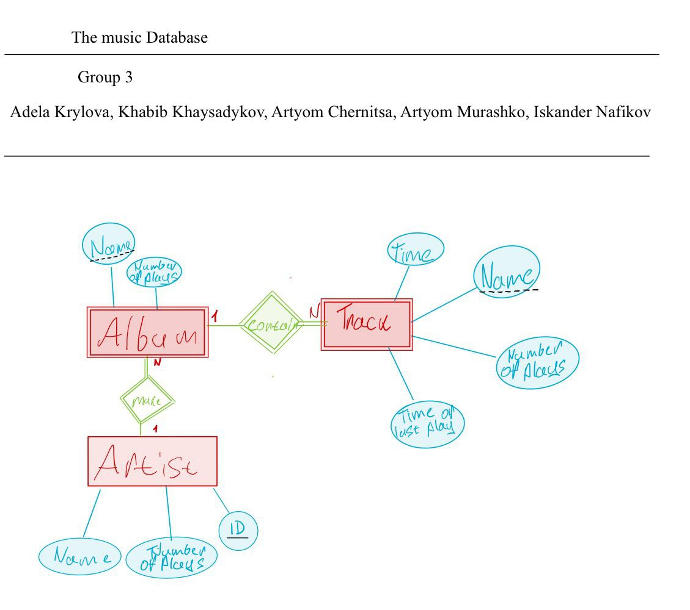

B20-02 group
1. Khabib Khaysadykov k.khaysadykov@innopolis.university
2. Adela Krylova a.krylova@innopolis.university
3. Artyom Chernitsa a.chernitsa@innopolis.university
4. Artem Murashko ar.murashko@innopolis.university
5. Iskander Nafikov i.nafikov@innopolis.university

From client we understood that:
- each Artist should have ID key attribute 
- Album should be identified based on its Artist and Name
- Track should be identified based on its Album and Name
- Finally it means, that this is weak entities and relations between them. That's why Name attribute of Track is partial key attribute and 	the Name of Album too. 
- Besides, there is only strict condition that Track can't exist without Album. Every Artist can have a lot of Albums.

​    
